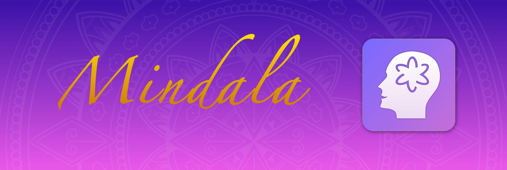
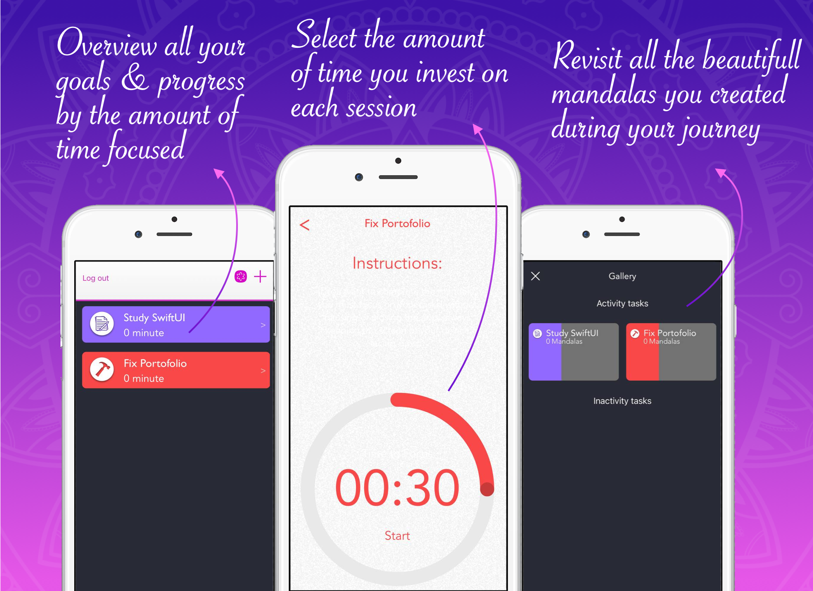
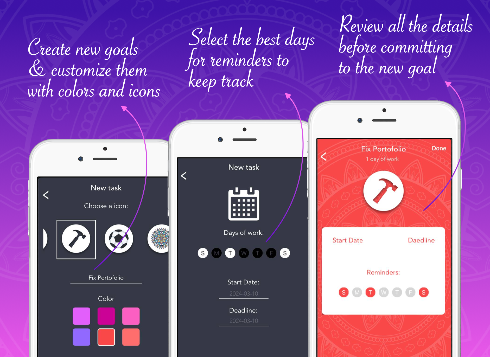
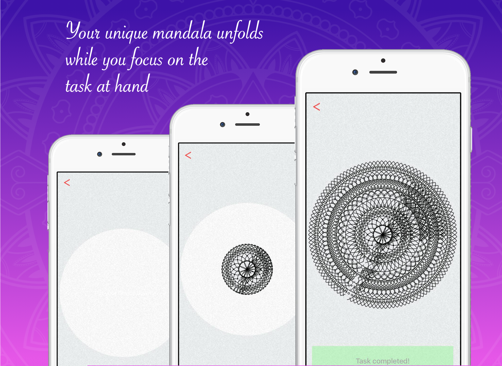

# Mindala

## Description
An iOS App that optimizes the users focus experience rewarding them by transforming their hard work into a beatiful and unique mandala. All while tracking the progress in total minutes focused and creating a gallery of all the mandalas generated. The app was inspired in the pomodoro technique however we wanted to add an extra value and use the sensors on the device to guarantee that the user couldn't check their phone otherwise the mandala generated is paused and they receive an incentivating prompt.

### Overview

Find an extensive option of features with real examples so you can try them for yourself while using the app. 
- See how yor goals are progressing with the amount of hours put in your focus sessions
- Use the intuitive selector to specify the period of your session
- Go to the mandala gallery to review the beautiful fruition of all your effort so far

Also enjoy a customized experience while creating your goals!
- Create a new goal with the best icon and color to match your spirit
- Choose when would be the best days to remind you and a timeframe yo achieve success
- Review all the info before committing to your new goal

Our key feature counts on generating an unique and beautiful mandala for each session. While also using the device's sensor to guarantee the user is not picking up they phone.
> The mandala is created in real time during the session

We invite everyone to try the app and transform their focus into art, where you can share with friends or even frame as decor!

> Have an ideia for a new feature? [Submit an issue](https://github.com/LucasCBarros/Mindala/issues/new).

### Technical Overview

- The information is saved in Firebase where we store user data as JSON and images
- The authentication is also using Firebase
- We opted a simple MVC Architecture
- Swift version: 4.0 (Updated to be able to run the project again)

### Known Issues & Improvements: 

- The Project uses storyboards
- No Unit Tests coverage.
- Update localizable strings to make the project more accessible.
- We tried keeping all the code and commentaries in english (But there might be something still in portugues, feel free to contact me)

## How to run

### Requirements
- Xcode 9.0+

### Getting Started
- Clone this repository
- run *$ pod init* and *$ pod install*
- Open the .xcodeproj and you are good to go.

## Contributing

Feel free to [open an issue](https://github.com/LucasCBarros/Mindala/issues/new) or [submit a pull request](https://github.com/LucasCBarros/Mindala/compare) if you have any improvement or feedback.

### Author

Lucas Barros, LucasCavalcanteDeBarros@gmail.com.
